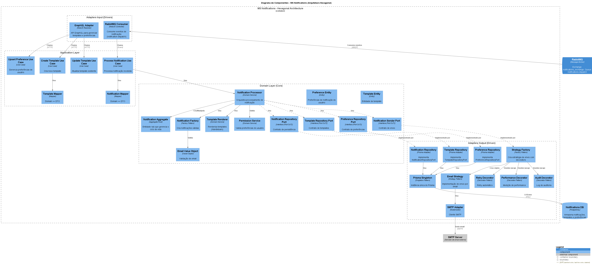

# Galeria de Diagramas C4

Este documento contém todos os diagramas arquiteturais do sistema, do Nível 1 (Contexto) ao Nível 4 (Código), utilizando o modelo C4.

## Sobre o Modelo C4

O modelo C4 foi criado para descrever a arquitetura de software em diferentes níveis de zoom, cada um servindo a um público diferente:

-   **Nível 1: Contexto (System Context):** A visão mais ampla. Mostra o sistema como uma "caixa preta" e como ele interage com usuários (Atores) e outros sistemas.
-   **Nível 2: Contêineres (Containers):** Desmembra o sistema em seus principais blocos de construção (microsserviços, bancos de dados, gateways).
-   **Nível 3: Componentes (Components):** Dá um "zoom" em um contêiner específico (como um microsserviço) e mostra seus principais componentes internos.
-   **Nível 4: Código (Code):** (Opcional) Mostra detalhes de implementação, como diagramas de classe ou UML, para ilustrar padrões de projeto.

---

## Nível 1: Diagrama de Contexto

Visão geral do sistema, seus usuários (Atores) e os sistemas externos com os quais ele se comunica.

---

## Nível 2: Diagrama de Contêineres

Detalha os microsserviços, bancos de dados, o API Gateway e o fluxo de comunicação (HTTP, gRPC) entre eles.

---

## Nível 3: Diagramas de Componentes

Um "zoom" em cada microsserviço, mostrando seus componentes internos e responsabilidades.

### Componentes - MS Events

### Componentes - MS Events Registration

### Componentes - MS Notifications

### Componentes - MS Payments

### Componentes - MS Users

---

## Nível 4: Diagramas de Código (Padrões de Projeto)

Diagramas de classe que ilustram a implementação de padrões de projeto chave.

### Padrão Builder (MS Events)

### Padrão Decorator (MS Notifications)

### Padrão Factory (MS Notifications)

### Padrão Combinado: Factory + Strategy + Decorator (MS Notifications)

### Padrão Singleton (Prisma Client)

### Padrão Strategy + Factory (MS Payments)

