# Galeria de Diagramas C4

Este documento contém todos os diagramas arquiteturais do sistema, do Nível 1 (Contexto) ao Nível 4 (Código), utilizando o modelo C4.

## Evolução Arquitetural

- **Segunda Etapa do Projeto**: Os diagramas foram atualizados para refletir:
- **Mensageria com RabbitMQ**: Comunicação assíncrona entre microsserviços
- **Arquitetura Hexagonal**: MS Notifications, MS Events e MS Currency reestruturados com DDD
- **Comunicação Híbrida**: gRPC (síncrono) + RabbitMQ (assíncrono)

## Sobre o Modelo C4

O modelo C4 foi criado para descrever a arquitetura de software em diferentes níveis de zoom, cada um servindo a um público diferente:

-   **Nível 1: Contexto (System Context):** A visão mais ampla. Mostra o sistema como uma "caixa preta" e como ele interage com usuários (Atores) e outros sistemas.
-   **Nível 2: Contêineres (Containers):** Desmembra o sistema em seus principais blocos de construção (microsserviços, bancos de dados, gateways).
-   **Nível 3: Componentes (Components):** Dá um "zoom" em um contêiner específico (como um microsserviço) e mostra seus principais componentes internos.
-   **Nível 4: Código (Code):** (Opcional) Mostra detalhes de implementação, como diagramas de classe ou UML, para ilustrar padrões de projeto.

---

## Nível 1: Diagrama de Contexto

Visão geral do sistema, seus usuários (Atores) e os sistemas externos com os quais ele se comunica.

**Atualizações**: Inclui API externa de cotações de moedas (MS Currency).

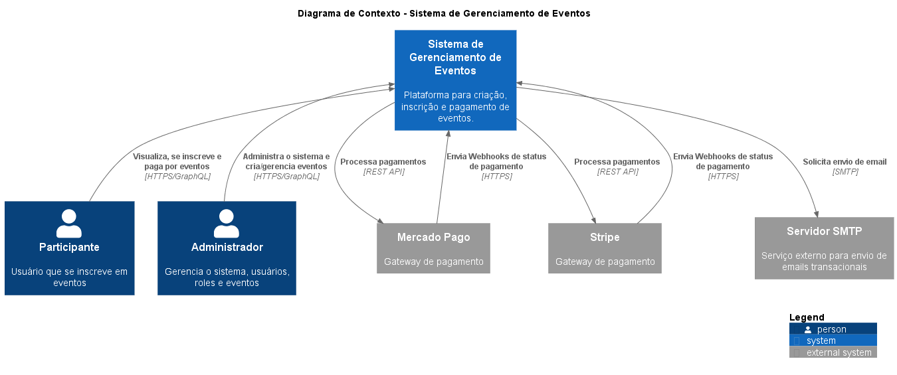

---

## Nível 2: Diagrama de Contêineres

Detalha os microsserviços, bancos de dados, o API Gateway e o fluxo de comunicação entre eles.

**Atualizações**:
- **RabbitMQ** adicionado como message broker
- **Comunicação Híbrida**: gRPC (síncrono) + RabbitMQ (assíncrono)
- MS Notifications, MS Events e MS Currency marcados como **Hexagonal**

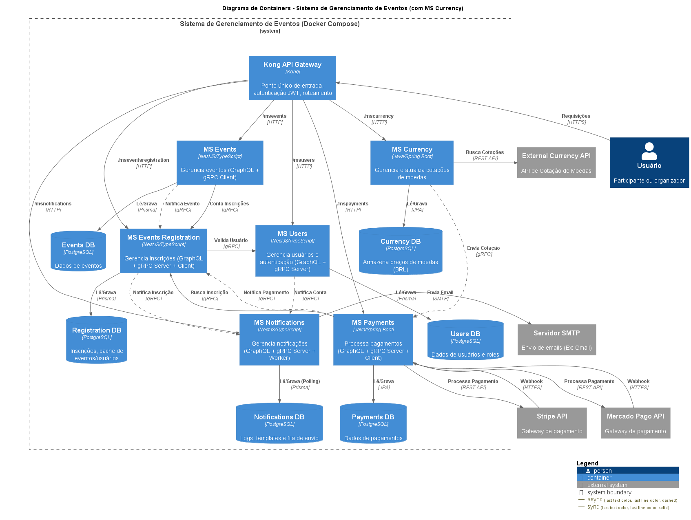

---

## Nível 3: Diagramas de Componentes

Um "zoom" em cada microsserviço, mostrando seus componentes internos e responsabilidades.

### Microsserviços com Arquitetura Hexagonal

Os seguintes microsserviços foram reestruturados na segunda etapa seguindo **Domain-Driven Design** e **Arquitetura Hexagonal (Ports & Adapters)**:

#### Componentes - MS Notifications (Hexagonal)
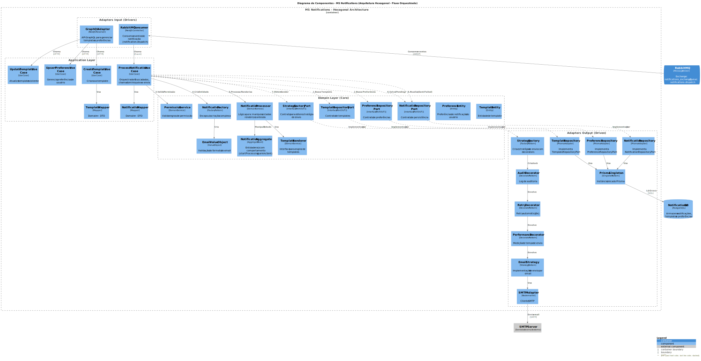

**Destaques**:
- **Domain**: NotificationAggregate, Email VO, Factories
- **Application**: Use Cases (Process, Create, Update)
- **Adapters IN**: GraphQL Adapter, RabbitMQ Consumer
- **Adapters OUT**: Prisma Repository, SMTP Adapter, Strategy + Decorators

#### Componentes - MS Events (Hexagonal)
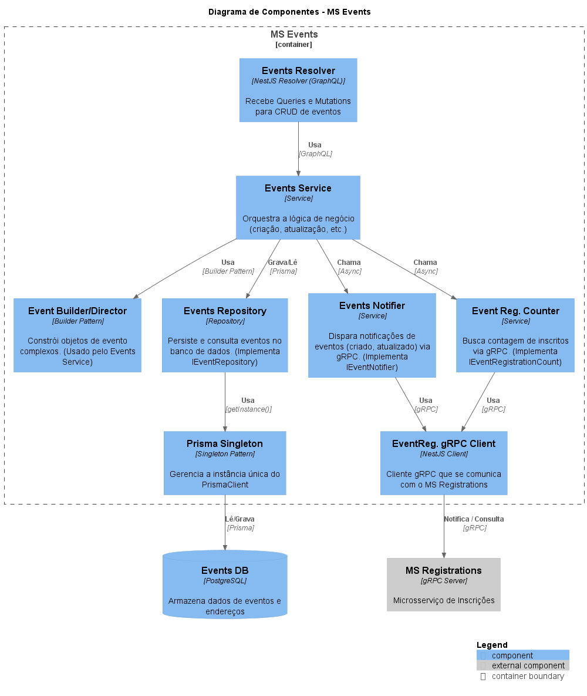

**Destaques**:
- **Domain**: Event Entity, Value Objects (Capacity, EventDate, Price), Builder Pattern
- **Application**: Use Cases (Create, Update, List, Delete)
- **Adapters IN**: GraphQL Adapter
- **Adapters OUT**: Prisma Repository, RabbitMQ Publisher, gRPC Client

#### Componentes - MS Currency (Hexagonal)
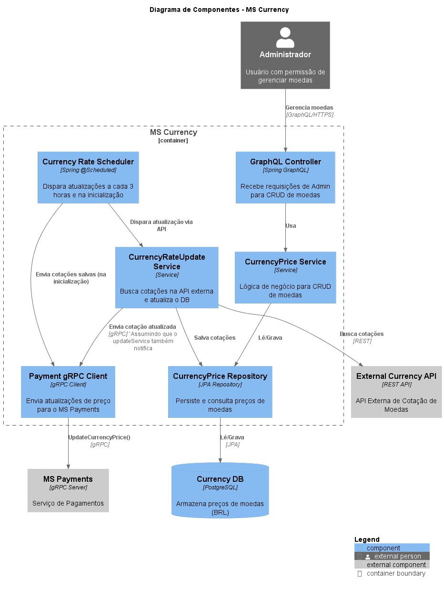

**Destaques**:
- **Domain**: CurrencyPrice Entity, Value Objects (CurrencyCode, Price)
- **Application**: Use Cases (CRUD + Sync)
- **Adapters IN**: GraphQL Adapter, Scheduler Adapter
- **Adapters OUT**: JPA Repository, Exchange Rate Adapter, RabbitMQ Publisher

---

### Microsserviços com Arquitetura em Camadas

Estes microsserviços mantêm a arquitetura em camadas tradicional (Controller/Service/Repository):

#### Componentes - MS Events Registration
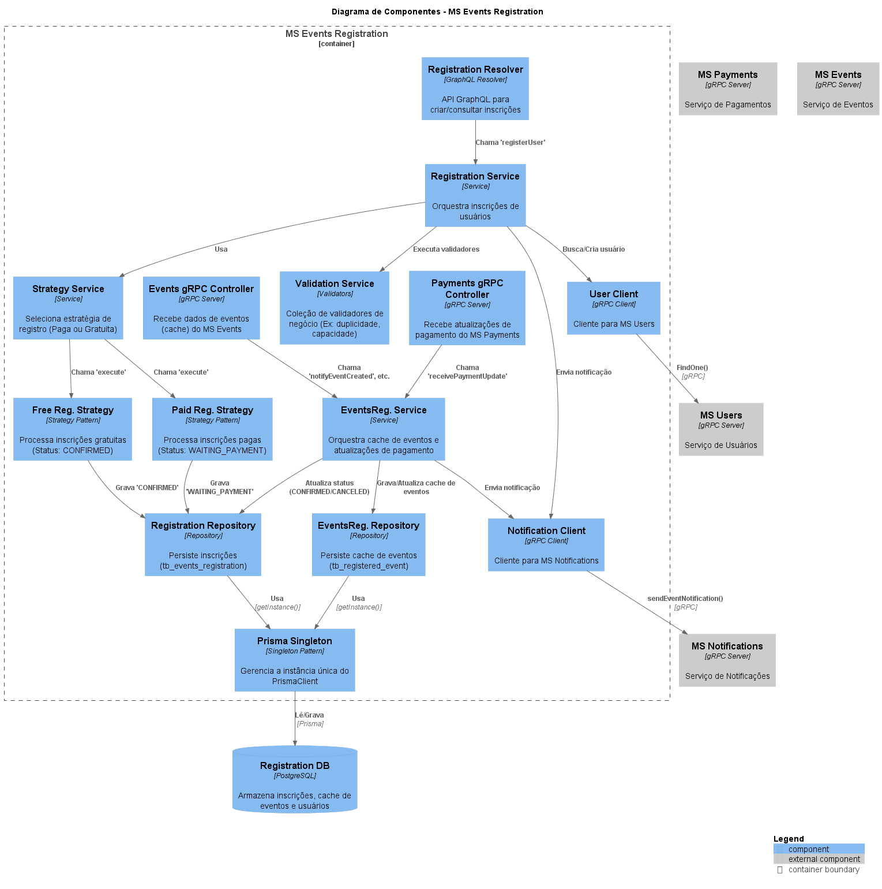

#### Componentes - MS Payments
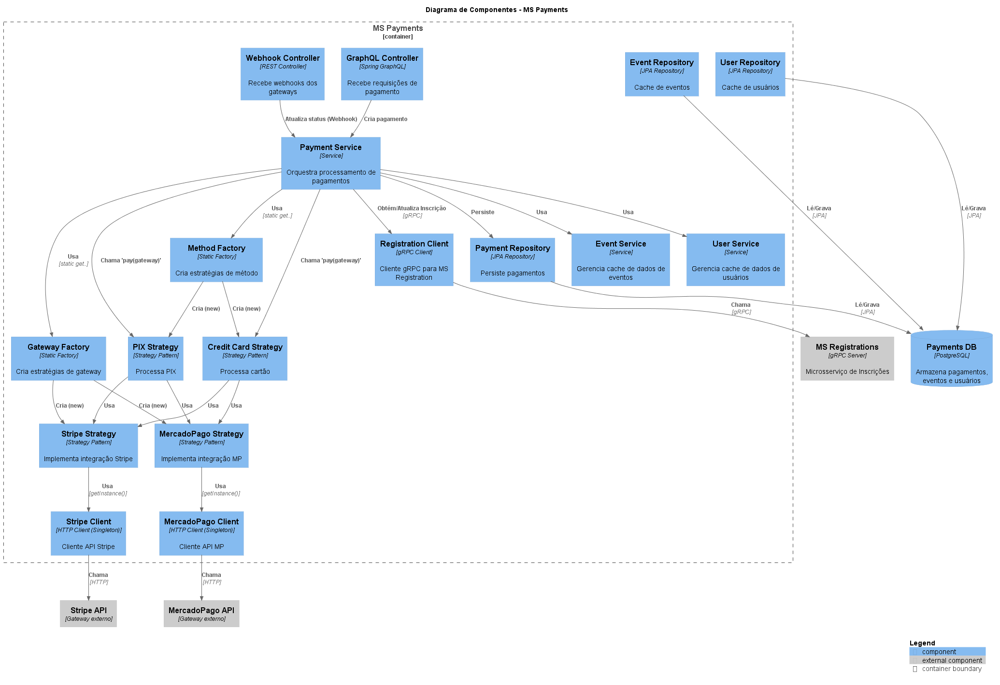

#### Componentes - MS Users

---

## Nível 4: Diagramas de Código (Padrões de Projeto)

Diagramas de classe que ilustram a implementação de padrões de projeto chave.

### Padrão Builder (MS Events)
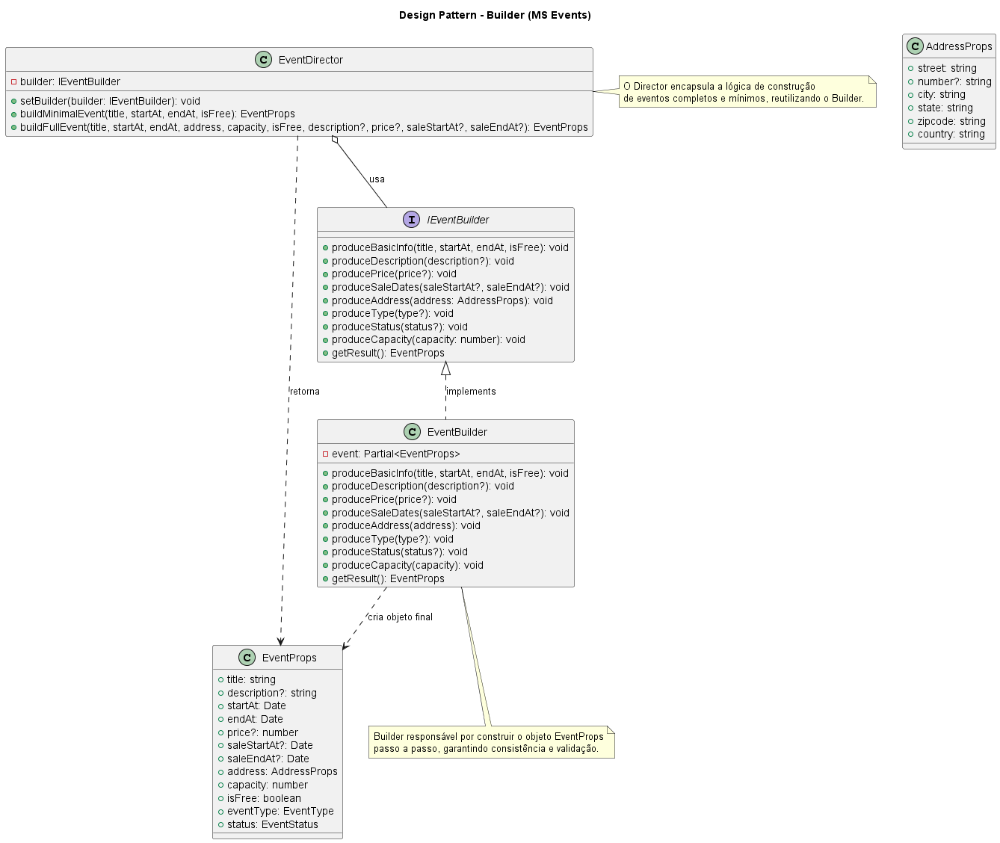

### Padrão Decorator (MS Notifications)
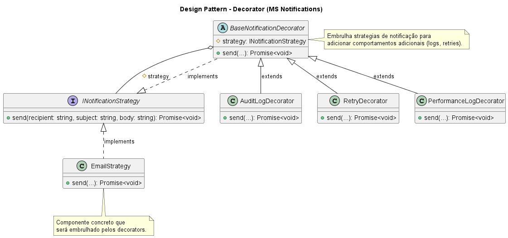

### Padrão Factory (MS Notifications)
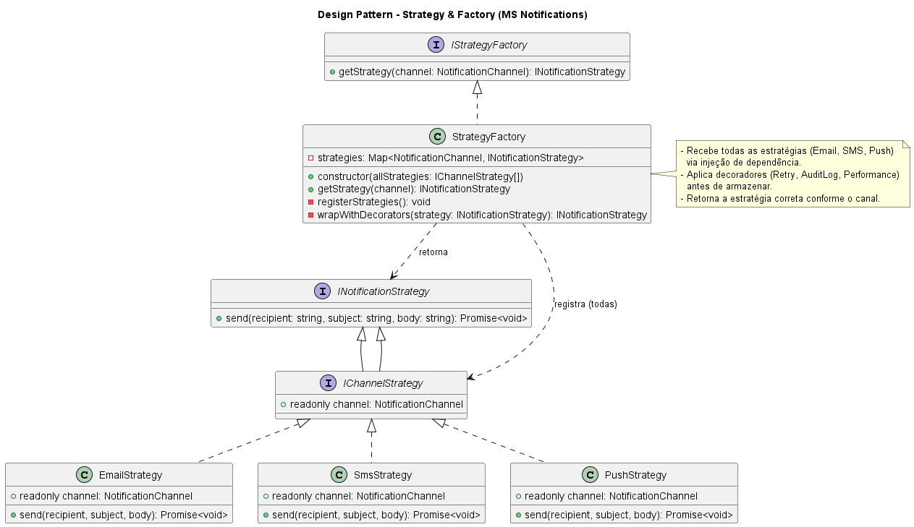

### Padrão Combinado: Factory + Strategy + Decorator (MS Notifications)
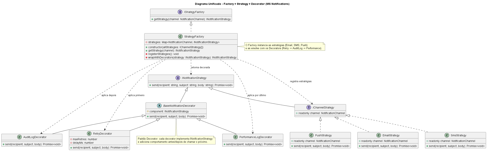

### Padrão Singleton (Prisma Client)
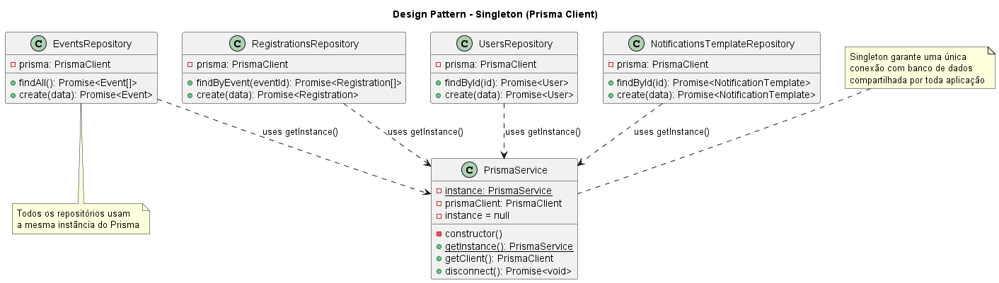

### Padrão Strategy + Factory (MS Payments)
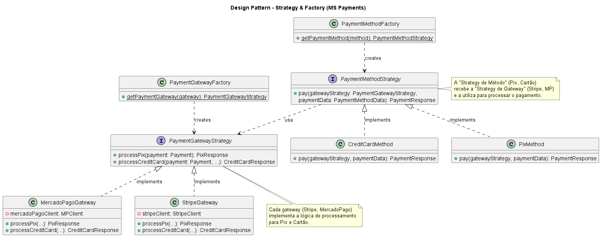
